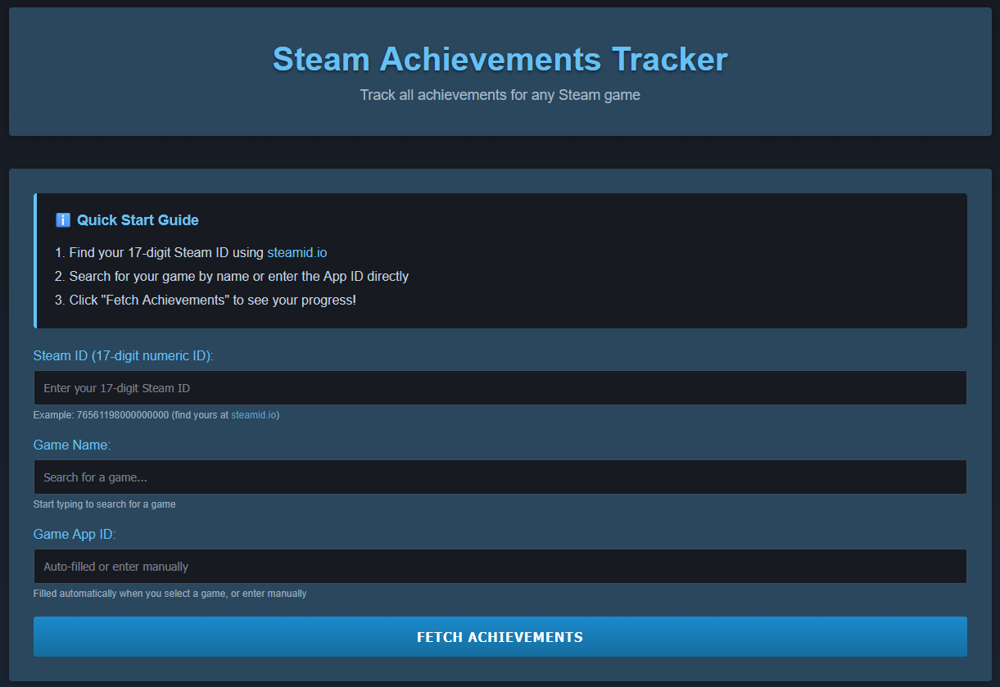

# Steam Achievements Tracker

A simple achievement tracker to find missing hidden achievements — quick, private, and to the point. No ads, no trackers, no third-party integrations.

**[Try it live →](https://h4n0sh1.github.io/SteamAchievements/)**

## Features

- **User search** — find your Steam profile by name; Steam ID fills automatically
- **Game search** — type a game name and pick from autocomplete results
- **Hidden achievement descriptions** — reveals descriptions for hidden achievements that Steam normally hides, pulled from community data
- **Full achievement list** — every achievement in one view: locked, unlocked, and hidden
- **Completion dashboard** — total, unlocked, regular remaining, hidden remaining, and completion percentage
- **Toggle view** — switch between all achievements and incomplete only
- **Zero config for users** — no API key needed, everything runs through a serverless proxy
- **Responsive** — works on desktop and mobile

## How to Use

1. **Search for your Steam profile** by name, or paste your 17-digit Steam ID directly
2. **Search for a game** by name or enter the App ID
3. Click **Fetch Achievements**

That's it.

## Self-Hosting

Want to run your own instance? See the [setup guide](docs/SETUP.md).

## Architecture

For technical details on how the proxy, APIs, and frontend fit together, see the [architecture docs](docs/ARCHITECTURE.md).

## License

MIT
